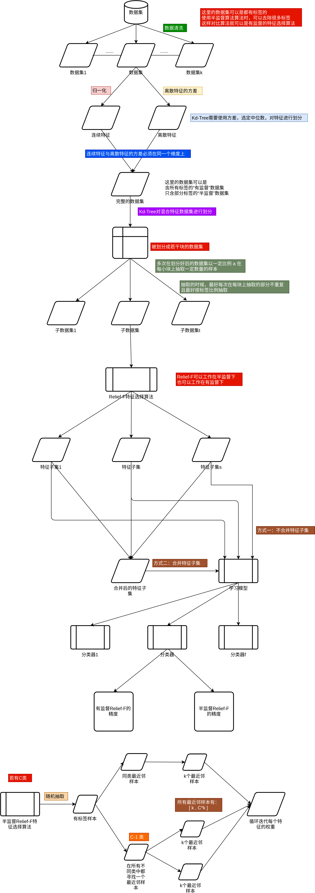

# graduation project

Some codes of graduation project

## Project Structure

* [readme.md](readme.md) ```readme```
* [data](data) ```dataset```
  * [originalDataSet](data/originalDataSet) ```original dataSet```
    * [1.txt](data/originalDataSet/1.txt)
    * ...
  * [processedDataSet](data/processedDataSet) ```processed dataSet```
    * [1.txt](data/processedDataSet/1.txt)
    * ...
  * [dealData](data/dealData) ```processing data set```
    * [1.py](data/dealData/abalone.py)
    * ...
* [core](core) ```The core code of all algorithms```
    * ...
* [unittestMine](unittestMine) ```test```
  * ...
* [runData](runData) ```Run on each data set```
  * [1.py](runData/abalone.py)
  * ..
* [result](result) ```Store results```
  * [1.md](result/abalone.md)
  * ...
* [analysisResult](analysisResult) ```analysis the result```
  * [1.py](analysisResult/abalone.py) or [1.m](analysisResult/abalone.m)
  * ...
* [GUI](GUI) ```The relevant code of the GUI part```
  * [resource](GUI/resource) 资源
  * ...
* [start.py](start.py) ```T entrance to the GUI```

大致流程图:



---

## 数据集

含混合特征的数据集，有标签，无标签均可，为了统一起见，都选择有标签的数据集

连续型特征需要归一化，离散特征分为有序离散特征和无序离散特征，这里都当成无序离散特征

如果缺失的样本较少，直接去除，否则对其进行一定的处理

以一定的比例  "去除" 标签，要多

处理后的文件为 csv 格式

如何确定离散特征的方差，同时使其与连续型特征的维度保持一致


小结：这部分的任务对应着 ```data``` 包，即将数据进行一定的处理，去除大部分的标签，得到符合要求的数据集，最终的每个数据集应该有两份，一份处理好的 “有监督” 含有所有标签的数据集，一份是处理好的 “无监督” 含少量标签的数据集

---

## 特征处理

连续特征需要归一化，离散特征需要有方差

方法：

熵


